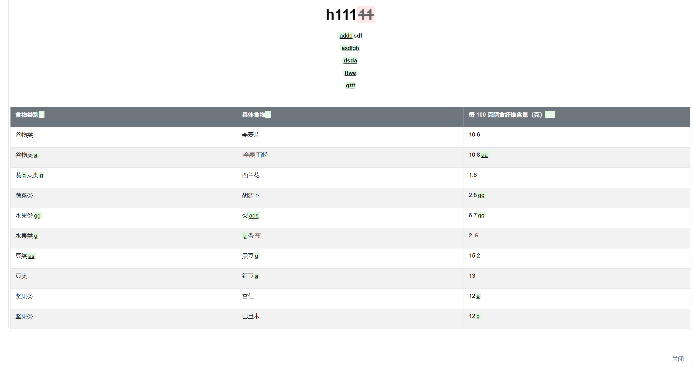

# tiptap-diff

## Project setup
```
yarn install
```

### Compiles and hot-reloads for development
```
yarn serve
```

### Compiles and minifies for production
```
yarn build
```

### Lints and fixes files
```
yarn lint
```

### Customize configuration
See [Configuration Reference](https://cli.vuejs.org/config/).

## 参考来自
https://segmentfault.com/a/1190000044613673

## Features

### feat(tiptap): 实现文档差异比较和标注高亮功能
- 新增 HTML 差分算法，用于比较文档变更
- 实现文本插入、删除、修改的标注高亮
- 添加元素插入、删除、替换的标注高亮
- 支持属性变更、标签变更的标注高亮
- 优化标注样式，确保复杂段落的正确显示
- 图片 resize 功能

## 效果图

